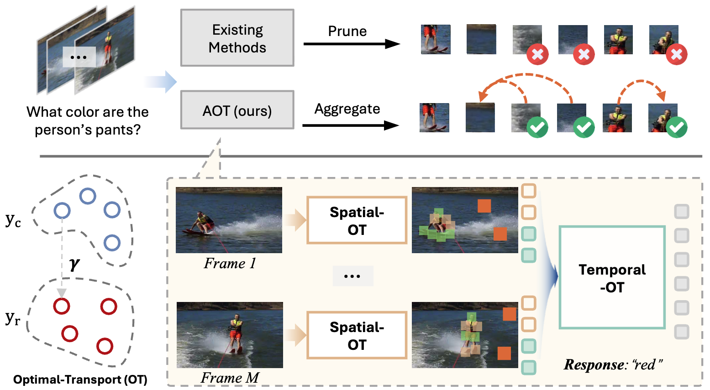

<div align="center">
	<h1>AOT: Token Reduction via Local and Global Contexts Optimization for Efficient Video Large Language Models</h1>
	<a href="https://arxiv.org/abs/2603.01400"></a>
	<a href="https://tyroneli.github.io/AOT"></a>
  <p align="center">
      <a href="https://tyroneli.github.io/" style="color:blue;">Jinlong Li</a> ·
      <a href="https://openreview.net/profile?id=~Liyuan_Jiang1" style="color:blue;">Liyuan Jiang</a> ·
      <a href="https://zchoi.github.io/" style="color:blue;">Haonan Zhang</a> ·
      <a href="https://scholar.google.com/citations?user=stFCYOAAAAAJ&hl=en" style="color:blue;">Nicu Sebe</a>
  </p>
  <h2 align="center">CVPR 2026</h2>
</div>


### About AOT

Video Large Language Models (VLLMs) demonstrate strong video understanding but suffer from inefficiency due to redundant visual tokens. Existing pruning primary targets intra-frame spatial redundancy or prunes inside the LLM with shallow-layer overhead, yielding suboptimal spatiotemporal reduction and underutilizing long-context compressibility. All of them often discard subtle yet informative context from merged or pruned tokens. In this paper, we propose a new perspective that elaborates token Anchors within intra-frame and inter-frame to comprehensively aggregate the informative contexts via local-global Optimal Transport (AOT). Specifically, we first establish local- and global-aware token anchors within each frame under the attention guidance, which then optimal transport aggregates the informative contexts from pruned tokens, constructing intra-frame token anchors. Then, building on the temporal frame clips, the first frame within each clip will be considered as the keyframe anchors to ensemble similar information from consecutive frames through optimal transport, while keeping distinct tokens to represent temporal dynamics, leading to efficient token reduction in a training-free manner. Extensive evaluations show that our proposed AOT obtains competitive performances across various short- and long-video benchmarks on leading video LLMs, obtaining substantial computational efficiency while preserving temporal and visual fidelity.


Overall pipeline of our AOT. Our method compresses tokens of video LLMs across spatiotemporal through optimal transport, first establishing token anchors within each frame to cover semantically important and spatially diverse token candidates, then utilizing optimal transport to aggregate the necessary informative cues within Intra-Frame at phase I, and finally shifting the optimization strategy into temporal within Inter-Frame at phase II. The proposed AOT preserves both temporal and visual integrity by utilizing efficient Sinkhorn-Knopp iteration to solve the optimal transport plan assignment.


#### 🔥🔥🔥 News

- **2026-02-21:** AOT has been accepted by **CVPR'26 main track** 🎉
- **2026-04-13:** The repo, paper, and webpage is released.


## Quick Start

### 1. 🛠️ Create the environment
```
git clone https://github.com/TyroneLi/AOT
cd AOT/LLaVA-NeXT

conda create -n AOT python=3.10 -y
conda activate llava
pip install --upgrade pip  # Enable PEP 660 support.
pip install -e ".[train]"
```

### 2. 🪚 Download or place checkpoints
#### Download the checkpoints from huggingface and put them into the local path
```
google/siglip-so400m-patch14-384 
lmms-lab/llava-onevision-qwen2-7b-ov 
lmms-lab/LLaVA-Video-7B-Qwen2
```

### 3. 🔥 Perform the Token Reduction Evaluation
The scripts in the [scripts](https://github.com/TyroneLi/AOT/tree/main/scripts) folder will guide you through the evaluation.
```
bash scripts/eval_ov-7b.sh
bash scripts/eval_vid-7b.sh
```

## Contact

If you have any questions, please feel free to contact with me at jinlong.szu [at] gmail [dot] com

## Citation
If you use AOT in academic or industrial research, please cite:

```bibtex
@inproceedings{li2026token,
  title={Token Reduction via Local and Global Contexts Optimization for Efficient Video Large Language Models},
  author={Li, Jinlong and Jiang, Liyuan and Zhang, Haonan and Sebe, Nicu},
  booktitle={Proceedings of the IEEE/CVF Conference on Computer Vision and Pattern Recognition (CVPR)},
  year={2026}
}
```


## Acknowledgements
Our codebase builds upon several excellent open-source projects: [LLaVA-NeXT](https://github.com/LLaVA-VL/LLaVA-NeXT), [lmms-eval](https://github.com/evolvinglmms-lab/lmms-eval).


## License
- **Code**: MIT License (see `LICENSE`).
- **Model weights**: Adobe Research License (see `LICENSE-WEIGHTS`).  The model weights are **not** covered by the MIT License.
