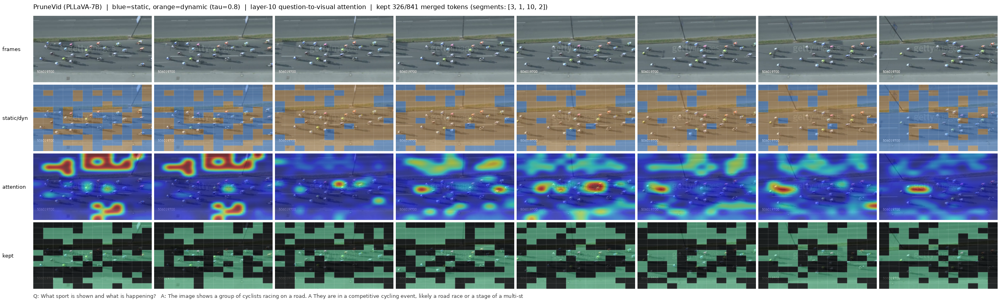
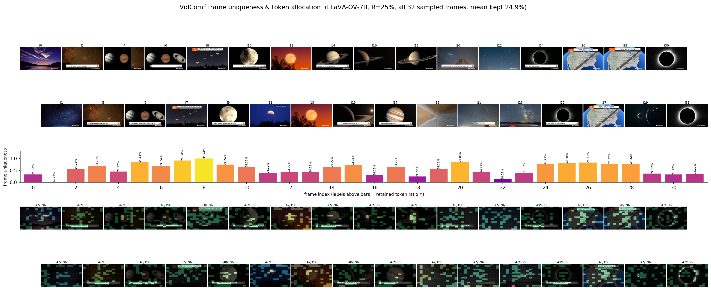
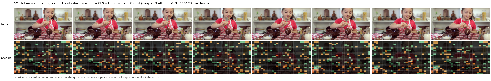

# Main Experiment Tables with Local Reproduction Rows

Reproduction of **PruneVid**, **VidCom²**, and **AOT** (training-free video token compression). Paper rows are quoted from each paper; **`(Reproduce)`** rows are produced locally in this repo. Same tables as `reproduction_report.pdf`.

## 1. PruneVid

| Method | Retained | FLOPs | MVBench | VideoMME | EgoSchema (Subset / Fullset) |
|--------|---------:|------:|--------:|---------:|:----------------------------:|
| PLLaVA | 100.0% | 1.00× | 46.6 | 44.4 | 47.8 / 42.6 |
| PLLaVA w/ FastV | 30.0% | 0.33× | 46.1 | 43.6 | 46.2 / 41.0 |
| PLLaVA w/ Prumerge | 55.7% | 0.53× | 45.6 | 43.8 | 45.2 / 40.4 |
| PLLaVA w/ Look-M | 20.0% | 1.00× | 46.6 | 44.3 | 47.0 / 42.3 |
| **PLLaVA w/ Ours** | **16.2%** | **0.23×** | **47.6** | **45.0** | **49.0 / 42.6** |
| PLLaVA w/ Ours *(Reproduce)* | 16.2% | 0.23× | 46.42 | 44.89 | 48.40 / 41.90 |
| ST-LLM | 100.0% | 1.00× | 54.9 | 42.0 | 56.2 / 45.6 |
| ST-LLM w/ FastV | 30.0% | 0.37× | 42.9 | 34.5 | 48.0 / 38.5 |
| ST-LLM w/ Look-M | 20.0% | 1.00× | 54.0 | 40.6 | 54.0 / 44.5 |
| **ST-LLM w/ Ours** | **15.1%** | **0.26×** | **54.3** | **41.4** | **54.6 / 44.7** |
| ST-LLM w/ Ours *(Reproduce, self-port)* | 15.1% | 0.26× | 54.80 | 42.59 | 59.80 / 45.10 |
| LLaVA-OneVision | 100.0% | 1.00× | 58.0 | 58.2 | 62.0 / 60.0 |
| LLaVA-OneVision w/ FastV | 30.0% | 0.30× | 57.2 | 57.6 | 62.6 / 60.0 |
| LLaVA-OneVision w/ Prumerge | 55.2% | 0.49× | 52.9 | 56.7 | 62.2 / 60.0 |
| LLaVA-OneVision w/ Look-M | 20.0% | 1.00× | 57.0 | 58.0 | 62.0 / 59.8 |
| **LLaVA-OneVision w/ Ours** | **17.0%** | **0.20×** | **57.5** | **58.6** | **62.6 / 59.5** |
| LLaVA-OneVision w/ Ours *(Reproduce, self-port)* | 17.0% | 0.20× | 57.23 | 58.37 | 64.40 / 61.78 |

> PruneVid main experiment table with local reproduction rows inserted below the paper Ours rows. PLLaVA uses the released implementation; ST-LLM and LLaVA-OneVision are self-ported because the official repository marks those PruneVid backbones as not yet released.

**PruneVid qualitative visualization — static/dynamic split, attention, kept tokens** on a new cycling-race video (PLLaVA-7B, 16 frames, 12x12 grid). Blue = static patches (merged temporally, tau=0.8), orange = dynamic; row 3 is layer-10 question-to-visual attention; row 4 is the LLM-stage top-alpha kept set. Script: `visualizations/vis_prunevid.py`; more examples in `visualizations/out/`.

## 2. VidCom²

| Backbone | Method / Ratio | MVBench | LongVideoBench | MLVU | VideoMME | Short | Medium | Long | Average (%) |
|----------|----------------|--------:|---------------:|-----:|---------:|------:|-------:|-----:|------------:|
| LLaVA-OV-7B | Upper bound | 56.9 | 56.4 | 63.0 | 58.6 | 70.3 | 56.6 | 48.8 | 100.0 |
| LLaVA-OV-7B | DyCoke, R=30% | 56.6 | 54.7 | 60.3 | 56.1 | 67.1 | 54.6 | 46.6 | 96.5 |
| LLaVA-OV-7B | Random, R=25% | 54.2 | 52.7 | 59.7 | 55.6 | 65.4 | 53.0 | 48.3 | 94.8 |
| LLaVA-OV-7B | FastV, R=25% | 55.5 | 53.3 | 59.6 | 55.3 | 65.0 | 53.8 | 47.0 | 94.9 |
| LLaVA-OV-7B | PDrop, R=25% | 55.3 | 51.3 | 57.1 | 55.5 | 64.7 | 53.1 | 48.7 | 94.1 |
| LLaVA-OV-7B | SparseVLM, R=25% | 56.4 | 53.9 | 60.7 | 57.3 | 68.4 | 55.2 | 48.1 | 97.5 |
| LLaVA-OV-7B | DyCoke, R=25% | 49.5 | 48.1 | 55.8 | 51.0 | 61.1 | 48.6 | 43.2 | 87.0 |
| LLaVA-OV-7B | **VidCom², R=25%** | **57.2** | **54.9** | **62.5** | **58.6** | **69.8** | **56.4** | **49.4** | **99.6** |
| LLaVA-OV-7B | VidCom², R=25% *(Reproduce)* | 57.00 | 55.27 | 62.09 | 58.33 | 69.33 | 56.56 | 49.11 | 99.3 |
| LLaVA-OV-7B | FastV, R=15% | 51.6 | 48.3 | 55.0 | 48.1 | 51.4 | 49.4 | 43.3 | 85.0 |
| LLaVA-OV-7B | PDrop, R=15% | 53.2 | 47.6 | 54.7 | 50.1 | 58.7 | 48.7 | 45.0 | 87.4 |
| LLaVA-OV-7B | SparseVLM, R=15% | 52.9 | 49.7 | 57.4 | 53.4 | 61.0 | 52.1 | 47.0 | 91.2 |
| LLaVA-OV-7B | **VidCom², R=15%** | **54.3** | **52.0** | **58.9** | **56.2** | **65.8** | **54.8** | **48.1** | **95.1** |
| LLaVA-OV-7B | VidCom², R=15% *(Reproduce)* | 54.48 | 53.10 | 60.47 | 55.74 | 65.56 | 53.78 | 47.89 | 95.2 |
| LLaVA-Video-7B | Upper bound | 60.4 | 59.6 | 70.3 | 64.3 | 77.2 | 62.1 | 53.4 | 100.0 |
| LLaVA-Video-7B | DyCoke, R=30% | 57.5 | 55.5 | 60.6 | 61.3 | 73.4 | 59.3 | 51.2 | 93.8 |
| LLaVA-Video-7B | FastV, R=25% | 53.8 | 51.2 | 57.8 | 59.3 | 67.1 | 60.0 | 50.8 | 89.7 |
| LLaVA-Video-7B | SparseVLM, R=25% | 55.4 | 54.2 | 58.9 | 60.1 | 71.1 | 59.1 | 50.1 | 91.6 |
| LLaVA-Video-7B | DyCoke, R=25% | 50.8 | 53.0 | 56.9 | 56.1 | 65.8 | 53.6 | 48.9 | 86.3 |
| LLaVA-Video-7B | **VidCom², R=25%** | **57.0** | **55.5** | **59.0** | **61.7** | **73.0** | **61.7** | **50.0** | **93.6** |
| LLaVA-Video-7B | VidCom², R=25% *(Reproduce)* | 56.88 | 56.62 | 57.24 | 61.85 | 72.89 | 61.67 | 51.00 | 93.5 |
| LLaVA-Video-7B | FastV, R=15% | 44.0 | 44.6 | 53.8 | 51.3 | 56.4 | 51.1 | 46.2 | 78.0 |
| LLaVA-Video-7B | SparseVLM, R=15% | 53.1 | 52.7 | 56.2 | 55.7 | 65.0 | 53.9 | 48.3 | 86.3 |
| LLaVA-Video-7B | **VidCom², R=15%** | **53.3** | **51.5** | **56.8** | **58.3** | **68.0** | **57.3** | **49.7** | **88.5** |
| LLaVA-Video-7B | VidCom², R=15% *(Reproduce)* | 53.33 | 52.28 | 54.94 | 58.22 | 68.00 | 56.89 | 49.78 | 88.0 |

> VidCom² main experiment table with local LLaVA-OV and LLaVA-Video reproduction rows inserted below the corresponding paper rows. Average(%) follows the paper's convention: the row's 7-column sum (MVBench, LongVideoBench, MLVU, VideoMME, Short/Medium/Long) divided by the corresponding Upper-bound row's 7-column sum. Reproduced Average(%) matches the paper within ≤0.5 pts on all four rows (OV R=25%: 99.3 vs 99.6; OV R=15%: 95.2 vs 95.1; Video R=25%: 93.5 vs 93.6; Video R=15%: 88.0 vs 88.5).

**VidCom² qualitative visualization — frame uniqueness & token allocation** on a new Video-MME astronomy video (LLaVA-OV-7B, R=25%). Unique frames get a larger per-frame retention ratio r_t; bottom row shows the retained 14x14 patches. Script: `visualizations/vis_vidcom2.py`; more examples in `visualizations/out/`.

## 3. AOT

### LLaVA-OneVision

| Method | Prefill FLOPs | FLOPs Ratio | Retained | MVBench | EgoSchema | LongVideoBench | VideoMME | Avg. Score | Avg. % |
|--------|--------------:|------------:|---------:|--------:|----------:|---------------:|---------:|-----------:|-------:|
| LLaVA-OV-7B | 40.8 | 100% | 100% | 58.3 | 60.4 | 56.4 | 58.6 | 58.4 | 100.0 |
| FastV | 9.3 | 22.8% | 100% | 55.9 | 57.5 | 56.7 | 56.1 | 56.5 | 96.7 |
| PDrop | 10.5 | 25.7% | 100% | 56.1 | 58.0 | 54.1 | 56.4 | 56.2 | 96.2 |
| DyCoke | 8.7 | 21.3% | 25% | 53.1 | 59.5 | 49.5 | 54.3 | 54.1 | 92.6 |
| VisionZip | 8.7 | 21.3% | 25% | 57.9 | 60.3 | 56.5 | 58.2 | 58.2 | 99.7 |
| PruneVid | 8.7 | 21.3% | 25% | 57.4 | 59.9 | 55.7 | 57.4 | 57.6 | 98.6 |
| FastVID | 8.7 | 21.3% | 25% | 56.5 | -- | 56.3 | 58.0 | -- | -- |
| **AOT** | **8.7** | **21.3%** | **25%** | **58.7** | **61.3** | **56.3** | **57.5** | **58.5** | **100.0** |
| AOT *(Reproduce)* | 8.7 | 21.3% | 25% | 57.75 | 61.18 | 54.75 | 54.89 | 57.14 | 97.8 |
| VisionZip | 7.0 | 17.2% | 20% | 57.7 | 59.8 | 55.2 | 57.9 | 57.7 | 98.8 |
| PruneVid | 7.0 | 17.2% | 20% | 57.2 | 59.7 | 54.7 | 56.9 | 57.1 | 97.8 |
| FastVID | 7.0 | 17.2% | 20% | 56.3 | -- | 57.1 | 57.9 | -- | -- |
| **AOT** | **7.0** | **17.2%** | **20%** | **58.1** | **61.3** | **56.2** | **57.2** | **58.2** | **99.7** |
| AOT *(Reproduce)* | 7.0 | 17.2% | 20% | 57.73 | 61.22 | 54.08 | 54.78 | 56.95 | 97.5 |
| VisionZip | 5.2 | 12.7% | 15% | 56.5 | 59.8 | 54.4 | 56.1 | 56.7 | 97.1 |
| PruneVid | 5.2 | 12.7% | 15% | 56.8 | 59.7 | 55.4 | 56.6 | 57.1 | 97.8 |
| FastVID | 5.2 | 12.7% | 15% | 56.0 | -- | 56.2 | 57.7 | -- | -- |
| **AOT** | **3.4** | **8.3%** | **15%** | **57.8** | **61.3** | **55.2** | **56.6** | **57.7** | **98.8** |
| AOT *(Reproduce)* | 3.4 | 8.3% | 15% | 57.33 | 60.98 | 52.80 | 54.22 | 56.33 | 96.5 |
| VisionZip | 3.4 | 8.3% | 10% | 53.5 | 58.0 | 49.3 | 53.4 | 53.5 | 91.6 |
| PruneVid | 3.4 | 8.3% | 10% | 56.2 | 59.8 | 54.5 | 56.0 | 56.6 | 96.9 |
| FastVID | 3.4 | 8.3% | 10% | 55.9 | -- | 56.3 | 57.3 | -- | -- |
| **AOT** | **5.2** | **12.7%** | **10%** | **57.0** | **60.6** | **54.2** | **56.1** | **57.0** | **97.6** |
| AOT *(Reproduce)* | 5.2 | 12.7% | 10% | 56.70 | 60.45 | 52.65 | 53.78 | 55.90 | 95.7 |

> AOT main experiment table on LLaVA-OneVision with local reproduction rows inserted below the corresponding paper AOT rows. All runs follow the authors' released evaluation config (`eval_ov-7b.sh`); EgoSchema full-test accuracy is obtained by submitting local predictions to the official validation server; LongVideoBench and VideoMME use a VTN-calibrated sweep so measured token retention matches the labeled ratios. Averages are computed over the four benchmarks, with Avg. % relative to the full-model baseline.

### LLaVA-Video

| Method | Prefill FLOPs | FLOPs Ratio | Retained | MVBench | EgoSchema | LongVideoBench | VideoMME | Avg. Score | Avg. % |
|--------|--------------:|------------:|---------:|--------:|----------:|---------------:|---------:|-----------:|-------:|
| LLaVA-Video-7B | 80.2 | 100% | 100% | 60.4 | 57.2 | 58.9 | 64.3 | 60.2 | 100.0 |
| FastV | 17.1 | 21.3% | 100% | 54.3 | 54.1 | 55.0 | 58.8 | 55.6 | 92.4 |
| PDrop | 19.5 | 24.3% | 100% | 55.9 | 54.3 | 54.7 | 61.9 | 56.7 | 94.2 |
| VisionZip | 9.3 | 18.9% | 25% | 56.7 | 54.7 | 54.7 | 60.7 | 56.7 | 94.2 |
| DyCoke | 9.3 | 18.9% | 25% | 50.8 | -- | 53.0 | 56.9 | -- | -- |
| **AOT** | **9.3** | **18.9%** | **25%** | **58.8** | **55.4** | **56.2** | **62.4** | **58.2** | **96.7** |
| AOT *(Reproduce)* | 9.3 | 18.9% | 25% | 58.42 | 55.85‡ | 56.24 | 62.52 | 58.26 | 96.8 |
| VisionZip | 9.3 | 11.6% | 15% | 56.7 | 54.7 | 54.7 | 60.7 | 56.7 | 94.2 |
| **AOT** | **9.3** | **11.6%** | **15%** | **57.8** | **55.2** | **55.0** | **62.0** | **57.5** | **95.5** |
| AOT *(Reproduce)* | 9.3 | 11.6% | 15% | 57.98 | 55.08‡ | 55.42 | 62.11 | 57.65 | 95.8 |

> AOT main experiment table on LLaVA-Video with local reproduction rows inserted below the corresponding paper AOT rows. ‡EgoSchema full-test labels are not public; accuracy is obtained by submitting the local predictions to the official validation server. Averages are computed over the four benchmarks, with Avg. % relative to the full-model baseline.

**AOT qualitative visualization — local/global token anchors** on a new cooking video (LLaVA-OV-7B, VTN=126/729 per frame). Green = Local anchors (shallow window CLS attention), orange = Global anchors (deep CLS attention); dimmed patches are merged into anchors via optimal transport. Script: `visualizations/vis_aot.py`; more examples in `visualizations/out/`.

---

## Repository contents

| Directory | Description |
|-----------|-------------|
| `PruneVid/` | PruneVid core, evaluation scripts, ST-LLM / OV integrations |
| `AOT/` | LLaVA-OneVision (AOT) baseline & PruneVid hooks |
| `VidCom2/` | VidCom² reproduction |
| `VidCom2-qwen/` | VidCom² Qwen variant (worktree copy) |

